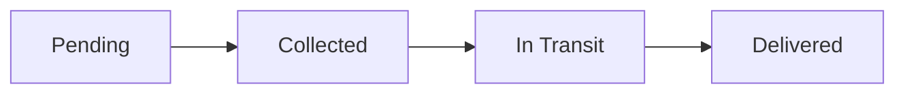

# 🏥 Medical Sample Tracking System

[](https://medoc-health.vercel.app/)
[](https://opensource.org/licenses/MIT)
[](https://developer.mozilla.org/en-US/docs/Web/JavaScript)
[](https://developer.mozilla.org/en-US/docs/Web/HTML)
[](https://developer.mozilla.org/en-US/docs/Web/CSS)

> A modern, responsive web application for tracking medical samples throughout their collection and delivery lifecycle. Built with vanilla JavaScript, featuring real-time status updates, automatic delivery scheduling, and an intuitive dashboard interface.

## 🚀 Features

### Core Functionality
- **📊 Real-time Dashboard** - Live statistics showing pending, collected, and total samples
- **🔄 Auto-refresh System** - Maintains 2 pending samples on page refresh for consistent testing
- **⏰ Time-based Delivery** - Set custom delivery times with automatic status updates
- **📱 Responsive Design** - Works seamlessly across desktop, tablet, and mobile devices
- **🎯 Status Tracking** - Complete sample lifecycle from pending → collected → in-transit → delivered

### Advanced Features
- **⚡ Live Status Updates** - Automatic status changes when delivery time is reached
- **📍 Navigation Integration** - Quick access to sample locations
- **📞 Contact Management** - Direct access to healthcare provider contacts
- **🕒 Timeline Visualization** - Visual timeline showing sample progress
- **🎨 Modern UI/UX** - Glassmorphism design with smooth animations

## 🛠️ Technology Stack

- **Frontend**: Vanilla JavaScript (ES6+)
- **Styling**: CSS3 with CSS Grid, Flexbox, and CSS Variables
- **Architecture**: Object-Oriented Programming with ES6 Classes
- **Responsive Design**: Mobile-first approach
- **Performance**: Optimized with efficient DOM manipulation

## 📁 Project Structure

```
medical-sample-tracker/
├── index.html          # Main HTML structure
├── styles.css          # CSS styling and animations
├── app.js             # Core JavaScript functionality
├── README.md          # Project documentation
└── assets/            # Images and icons (if any)
```

## ⚡ Quick Start

### Prerequisites
- Modern web browser (Chrome, Firefox, Safari, Edge)
- No server setup required - runs entirely in the browser

### Installation

1. **Clone the repository**
   ```bash
   git clone https://github.com/yourusername/medical-sample-tracker.git
   cd medical-sample-tracker
   ```

2. **Open the application**
   ```bash
   # Simply open index.html in your browser
   open index.html
   # OR use a local server
   python -m http.server 8000
   ```

3. **Start tracking samples!** 🎉

## 🎮 How to Use

### Basic Operations

1. **View Dashboard**
   - See real-time statistics of all samples
   - Monitor pending, collected, and total counts

2. **Collect Samples**
   - Click "Collect" button on pending samples
   - Sample automatically moves to "In Transit" status

3. **Set Delivery Time**
   - After collecting, set a custom delivery time
   - System automatically updates status when time is reached

4. **Refresh System**
   - Click refresh button to reset to 2 pending samples
   - Perfect for testing and demonstrations

### Sample Lifecycle



## 🏗️ Architecture

### Core Classes

- **`MedicalSampleTracker`** - Main application controller
- **Sample Management** - CRUD operations for medical samples
- **Time Management** - Handles delivery scheduling and status updates
- **UI Rendering** - Dynamic DOM manipulation and updates

### Key Methods

```javascript
// Core functionality
createDefaultSamples()    // Initializes sample data
collectSample(id)         // Moves sample to in-transit
setDeliveryTime(id)       // Schedules delivery
checkDeliveryTimes()      // Updates status based on time
```

## 🎨 Design System

### Color Palette
- **Primary**: Purple gradient (#667eea → #764ba2)
- **Success**: Green (#2ed573)
- **Warning**: Orange (#ffa502)
- **Error**: Red (#ff4757)
- **Info**: Blue (#5352ed)

### Typography
- **Font Family**: System fonts (-apple-system, BlinkMacSystemFont)
- **Font Weights**: 400 (regular), 600 (semibold), 700 (bold)

## 📊 Performance Features

- **Efficient Updates**: Only re-renders changed components
- **Memory Management**: Proper cleanup of intervals and event listeners
- **Responsive Loading**: Fast initial load with minimal dependencies
- **Browser Compatibility**: Works on all modern browsers

## 🔒 Security Considerations

- **No External Dependencies**: Runs entirely client-side
- **Data Privacy**: No data sent to external servers
- **XSS Protection**: Safe DOM manipulation practices
- **Input Validation**: Proper validation for user inputs

## 🧪 Testing

### Manual Testing Checklist
- [ ] Page loads correctly
- [ ] Refresh maintains 2 pending samples
- [ ] Sample collection workflow works
- [ ] Delivery time setting functions
- [ ] Automatic status updates occur
- [ ] Responsive design works on mobile

### Browser Testing
- ✅ Chrome (Latest)
- ✅ Firefox (Latest)
- ✅ Safari (Latest)
- ✅ Edge (Latest)

## 🚀 Deployment

### GitHub Pages
```bash
# Enable GitHub Pages in repository settings
# Select 'main' branch as source
# Access via: https://yourusername.github.io/medical-sample-tracker
```

### Netlify
```bash
# Connect GitHub repository to Netlify
# Auto-deploy on every push to main branch
```

### Local Server
```bash
# Python 3
python -m http.server 8000

# Node.js
npx http-server

# PHP
php -S localhost:8000
```

## 🤝 Contributing

Contributions are welcome! Here's how you can help:

1. **Fork the repository**
2. **Create a feature branch** (`git checkout -b feature/amazing-feature`)
3. **Commit your changes** (`git commit -m 'Add amazing feature'`)
4. **Push to the branch** (`git push origin feature/amazing-feature`)
5. **Open a Pull Request**

### Development Guidelines
- Follow ES6+ standards
- Maintain responsive design
- Write clear, commented code
- Test across multiple browsers

## 📈 Future Enhancements

- [ ] **Database Integration** - Persistent data storage
- [ ] **User Authentication** - Multi-user support
- [ ] **Notifications** - Push notifications for status updates
- [ ] **Analytics Dashboard** - Advanced reporting features
- [ ] **API Integration** - Hospital management system integration
- [ ] **Barcode Scanning** - Mobile sample scanning
- [ ] **Geolocation** - Real-time tracking with GPS

## 🐛 Known Issues

- Time checking interval runs every 10 seconds (can be optimized)
- No data persistence between browser sessions
- Limited to browser timezone

## 📞 Support

If you encounter any issues or have questions:

- **Create an Issue**: [GitHub Issues](https://github.com/yourusername/medical-sample-tracker/issues)

- **LinkedIn**: [Your LinkedIn Profile](https://www.linkedin.com/in/zaidparvaiz/)


## 🙏 Acknowledgments

- Design inspiration from modern healthcare applications
- Icons from system emoji set
- Color palette inspired by modern medical interfaces


**⭐ Star this repository if you found it helpful!**
📧 [Contact](mailto:zaidu9123@gmail.com) | 

---

*Built with ❤️ for better healthcare management*
